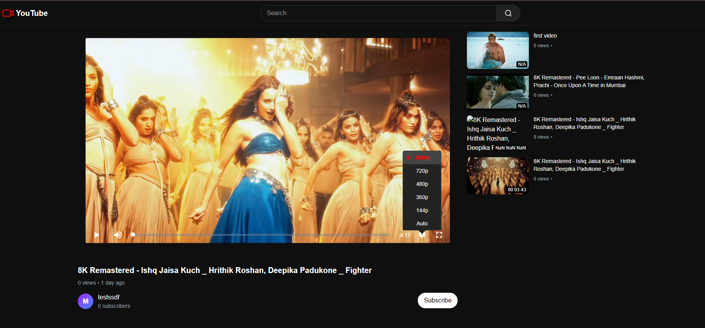

# 🎥YouTube Clone Project

A minimal full-stack video-sharing platform inspired by YouTube. This project includes basic features like user authentication, channel creation, video uploading, and a public video list display.

## 🚀 Features

- 🔐 **User Authentication**
  - Register new users
  - Login/logout functionality
- 📺 **Channel Management**
  - Create a personal video channel
- ⬆️ **Video Upload**
  - Upload and store video files
  - Add titles and descriptions
- 📃 **Video List Display**
  - Show all uploaded videos in a list
  - Play videos via HTML5 player

## 📂 Tech Stack

- **Frontend**: React / HTML / CSS / JavaScript / redux-toolkit
- **Backend**: Node.js / Express
- **Database**: MongoDB 
- **Storage**: Local 

## ⚙️ Installation

1. Clone the repository:
   ```bash
   [git clone https://github.com/your-username/youtube-clone.git](https://github.com/V4Ual/y-clone.git)
   cd y-clone



